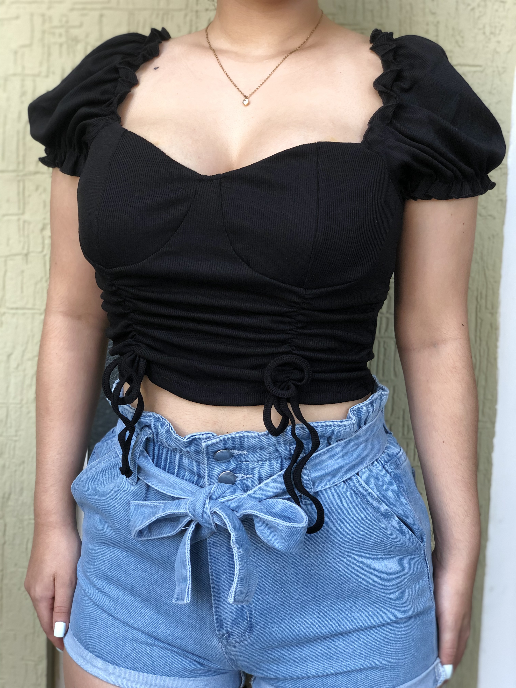

<!DOCTYPE html>
<html lang="es"> 
<head>
     <meta charset="UTF-8">
     <meta http-equiv="X-UA-Compatibel" content="IE=edge">
     <meta name="viewport" content="width-device-width,  initial-scale=1.0">
     <title>Rosé Store</title> 
     <link rel="shortcut icon" href="img/logo-laura3.png" type="image/x-icon">
     <link rel="stylesheet" href="./estilosscss.css">
</head>
<body bgcolor="F9DBEF" text="000000">

    <header>
        <nav>
            <a href="#">Inicio</a>
            <a href="#">Historia de Rosé</a> 
            <a href="#">Tendencia del 2022</a>   
            <a href="#">Damas</a> 
            <a href="#">Contactanos</a>  

        </nav>
         <section class="textos-header">
             <h1>En Rosé Store te acompañamos en tus momentos especiales</h1>

         </section>
    </header>
<main>
<section class="contenedor historia de rosé">
    <h2 class="titulo">Historia de Rosé</h2>
    

        
        

            <h3>La importancia del producto</h3>
            
 En Rosé Store la idea siempre ha sido tener un producto con buen diseño y un precio muy accesible: “La moda no es riqueza sino belleza”, repetimos como mantra.  

            <h3>Apostamos por una mujer real y por la diversidad</h3>
            
 Quizás gran parte de nuestro éxito es que nuestra ropa es fiel a la filosofía de crear y vender moda para una mujer real que evidentemente presenta diversidad de tallas.  

        

    

</section>
<section class="tendencia-del-2022">
    

        <h2 class="titulo">Tendencias del 2022</h2>
        

          

              

          
  
        

        

            

                
            

        

        

            

                
            

        

        

            

                
            

        

        

            

                
            

        

        

            

                
            

        

    

</section>
<section>
    

        <h2 class="titulo">Damas</h2> 
        <ul>
            <li></li>
            <li></li>
            <li></li>
            <li></li>
            <li></li> 
            <li></li>                                                                   
        
        </ul> 

    

</section>
<section id="contacto">
    <h1>Contactanos</h1>
    
    <form>
          
         <label for="nombre">Nombre:</label>
         <input type="text" id="nombre" placeholder="Ingrese su nombre">

         <label for="correo">Correo:</label>
         <input type="text" id="nombre" placeholder="Ingrese su correo electronico">

         <label for="mensaje">Mensaje:</label>
         <textarea id="mensaje" placeholder="Deje su mensaje aquí"></textarea>

         <input type="submit" name="" value="Enviar">

    </form>

</section>
<footer>
    

        

        <h2 class="Titulo-final">&copy; ROSÉ STORE 2022 | Laura Serrudo </h2>
    

</footer>
</main>

</body>
</html>
